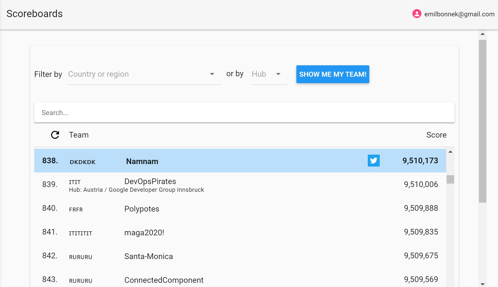
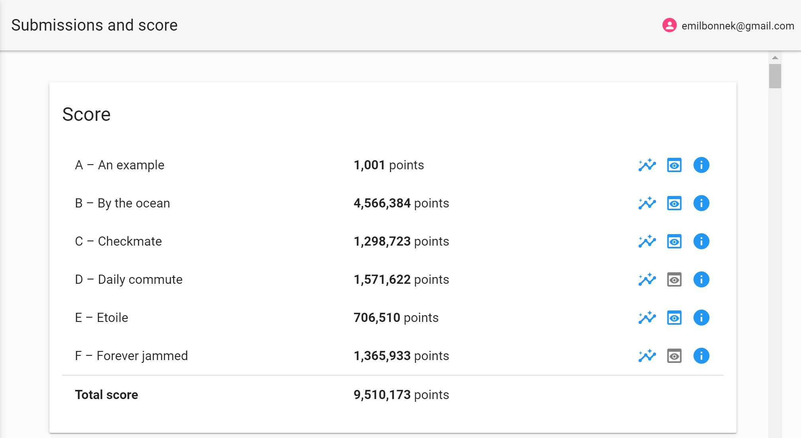

# Google Hashcode 2021

On 24th of february 2021 I and two friends partook in Google Hashcode for the third time.
This repository is the code our team had produced by the time limit. This year the problem was about algorithmically scheduling traffic lights to accommodate a city's traffic pattern.
The exact problem statement is available [here](hashcode_2021_online_qualifications.pdf).

We scored a total of 9,510,173 points, earning us 838 place out of 9,004 participating teams (just inside the top 10%).

And here is how our points were distributed over the various input datasets.

